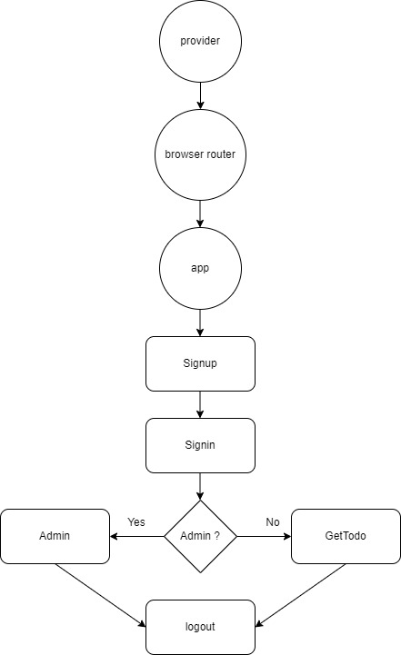

## User Stories

- **Signup:** As an anon I can sign up in the platform so that I can start get my todo tasks
- **Login:** As a user I can login to the platform so that I can log my exit points and see my tasks ,update ,delete and create new task
- **Logout:** As a user I can logout from the platform so no one else can use it
### functions for users
- **Get tasks** As a user I can see my tasks
- **Update task** As a user I can edit an exit task
- **Delete task** As a user I can delete task 
- **Create task** As a user I can create a task 
### functions for admin
- **Get tasks** As admin I can see all users tasks
- **Delete task** As admin I can delete task for any user

## backend 
# Schema
#### user
```
const user = new mongoose.Schema({
  email: {
    type: String,
    required: true,
    lowercase: true,
    unique: true,
  },
  password: {type:String,required:true},
  role: [{ type: mongoose.Schema.Types.ObjectId ,ref:"role"}],
  todo: [
    {
      type:{type: mongoose.Schema.Types.ObjectId,
      ref:"todos"},
    },
  ],
});
```
#### role
``` 
const role = new mongoose.Schema({
  role: {
    type: String,
    required: true,
  },
  permissions: {type:Array,required:true},
});
```
#### todo
```
const todos = new mongoose.Schema({
  name: { type: String, required: true },
  isDelete: { type: Boolean, default: false },
  owner:  { type: mongoose.Schema.Types.ObjectId, ref: "user" },
});
```
## Components

- Login
- Signup
- Logout
- SignupPage
- GetTodo
- Admin

#Digrams
##ER digram


